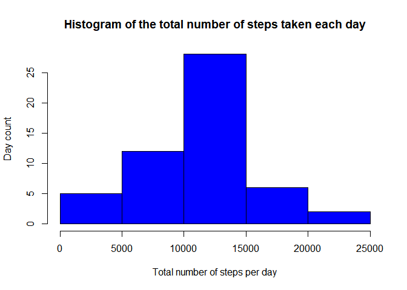
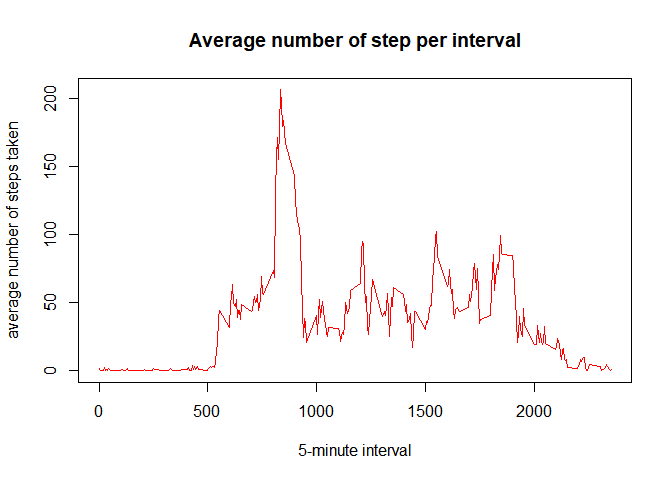
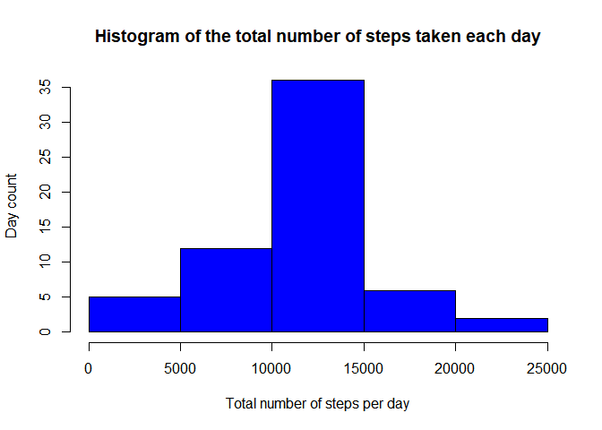
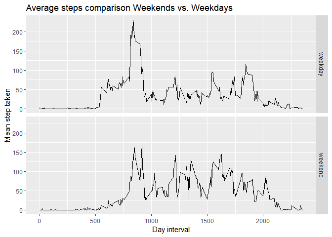

## Loading and preprocessing the data

```r
unzip("activity.zip")
activity <- read.csv("activity.csv", na.strings = "NA")
activity$date <- as.Date(activity$date)
str(activity)
```

```
## 'data.frame':	17568 obs. of  3 variables:
##  $ steps   : int  NA NA NA NA NA NA NA NA NA NA ...
##  $ date    : Date, format: "2012-10-01" "2012-10-01" ...
##  $ interval: int  0 5 10 15 20 25 30 35 40 45 ...
```


## What is mean total number of steps taken per day?
a. Aggregate the number of step per day
b. Make a histogram of the total number of steps taken each day
c. Calculate and report the mean and median total number of steps taken per day


```r
# Aggregate the number of step per day
stepperday <- aggregate(.~date, data = activity, sum)

# Make a histogram of the total number of steps taken each day
hist(stepperday$steps,
     xlab = "Total number of steps per day",
     ylab = "Day count",
     main = "Histogram of the total number of steps taken each day",
     col = "blue")
```

<!-- -->

```r
# Calculate and report the mean and median total number of steps taken per day
meansteps <- mean(stepperday$steps)
mediansteps <- median(stepperday$steps)
```
The mean total number of steps is 1.0766189\times 10^{4} and the median is 10765

## What is the average daily activity pattern?
1. Make a time series plot (i.e. type = "l") of the 5-minute interval (x-axis) and the average number of steps taken, averaged across all days (y-axis)

```r
# Aggregate the number of step per day
stepperinterval <- aggregate(.~interval, data = activity, mean)
# Display the plot
plot(x = stepperinterval$interval,
     y = stepperinterval$steps,
     xlab = "5-minute interval",
     ylab = "average number of steps taken",
     main = "Average number of step per interval",
     type = "l",
     col = "red")
```

<!-- -->

2. Which 5-minute interval, on average across all the days in the dataset, contains the maximum number of steps?

```r
maxstep <- stepperinterval$interval[which.max(stepperinterval$steps)]
```

The interval with the highest average of steps is interval 835.


## Imputing missing values
Note that there are a number of days/intervals where there are missing values (coded as NA). The presence of missing days may introduce bias into some calculations or summaries of the data.

1. Calculate and report the total number of missing values in the dataset (i.e. the total number of rows with NAs)

```r
numna <- sum(is.na(activity$steps))
```

The total number of rows with NAs is 2304.

2. Devise a strategy for filling in all of the missing values in the dataset. The strategy does not need to be sophisticated. For example, you could use the mean/median for that day, or the mean for that 5-minute interval, etc.

To fill the NAs, we'll use the rounded average number of step per interval.

3. Create a new dataset that is equal to the original dataset but with the missing data filled in.


```r
#merge the mean step by interval with the intial dataset 
activitynona <- merge(activity, stepperinterval, by.x = "interval", by.y = "interval", suffixes = c("","mean"))

#update the NA values wit the averages
activitynona$steps <- ifelse(is.na(activitynona$steps), activitynona$stepsmean, activitynona$steps)
```

4. Make a histogram of the total number of steps taken each day and Calculate and report the mean and median total number of steps taken per day. Do these values differ from the estimates from the first part of the assignment? What is the impact of imputing missing data on the estimates of the total daily number of steps?


```r
# Aggregate the number of step per day
stepperdaynona <- aggregate(.~date, data = activitynona, sum)

# Make a histogram of the total number of steps taken each day
hist(stepperdaynona$steps,
     xlab = "Total number of steps per day",
     ylab = "Day count",
     main = "Histogram of the total number of steps taken each day",
     col = "blue")
```

<!-- -->

```r
# Calculate and report the mean and median total number of steps taken per day
meanstepsnona <- mean(stepperdaynona$steps)
medianstepsnona <- median(stepperdaynona$steps)
```
The mean total number of steps is 1.0766189\times 10^{4} and the median is 1.0766189\times 10^{4}.
The mean did not change byt the median moves slightly and is now allignes with the mean.

## Are there differences in activity patterns between weekdays and weekends?
For this part the weekdays() function may be of some help here. Use the dataset with the filled-in missing values for this part.

1. Create a new factor variable in the dataset with two levels -- "weekday" and "weekend" indicating whether a given date is a weekday or weekend day.


```r
activitynona$daytype <- factor(ifelse(weekdays(activitynona$date) %in% c("Saturday", "Sunday"), "weekend", "weekday"))
```

2. Make a panel plot containing a time series plot (i.e. type = "l") of the 5-minute interval (x-axis) and the average number of steps taken, averaged across all weekday days or weekend days (y-axis).


```r
library(ggplot2)

stepperintervaldaytype <- aggregate(.~interval+daytype, data = activitynona, mean)

qplot(interval, steps, data=stepperintervaldaytype,
      geom="line",
      xlab="Day interval",
      ylab="Mean step taken",
      main="Average steps comparison Weekends vs. Weekdays",
      facets =daytype ~ .)
```

<!-- -->
